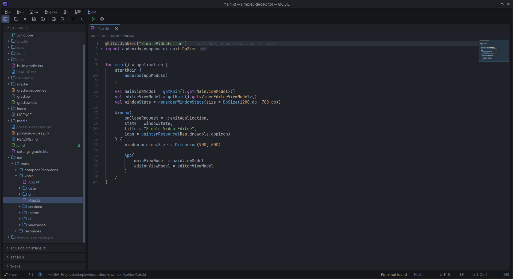
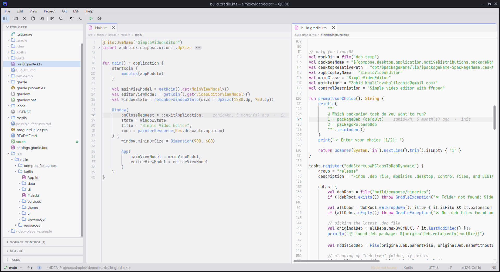
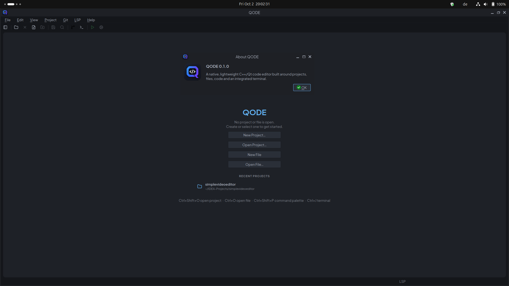

# QODE

A native C++/Qt 6 code editor for Linux: project explorer, tabbed syntax-highlighted editor and an integrated terminal (`Ctrl+J`).

## Screenshots



*Editor with project explorer, breadcrumbs, code folding, minimap and inline git blame.*



*Split editor: files side by side, each with its own tabs and breadcrumbs.*



*Welcome page with quick actions and recent projects.*

## Build

Requires Qt 6 (Core, Gui, Widgets), qmake6 and a C++17 compiler.

```sh
mkdir build && cd build
qmake6 ../QODE.pro
make -j$(nproc)
./qode [project-dir | file ...]
sudo make install        # optional, PREFIX defaults to /usr/local
```

## Language servers (LSP)

QODE is an LSP client; it does not ship any language server (for Kotlin and the web languages it can download one for you on request). Install the server for your language and QODE finds it on `PATH` (or use **LSP > Set Server Path…**). With no server installed everything else works as before, and the status bar shows a hint when you open a file that has one available.

| Language | Server | Install |
|---|---|---|
| C / C++ | [clangd](https://clangd.llvm.org) | `sudo apt install clangd` · `sudo dnf install clang-tools-extra` · `sudo pacman -S clang` |
| Kotlin | [kotlin-lsp](https://github.com/Kotlin/kotlin-lsp) (JetBrains, Alpha) | **LSP > Download and Set Up…** (see below) |
| JavaScript / TypeScript (`.js .jsx .mjs .cjs .ts .tsx .mts .cts`) | [typescript-language-server](https://github.com/typescript-language-server/typescript-language-server) | **LSP > Download and Set Up…** (see Web development) |
| HTML | vscode-html-language-server | same install |
| CSS / SCSS / Less | vscode-css-language-server | same install |
| JSON / JSONC | vscode-json-language-server | same install |

clangd needs to know your compiler flags: put a `compile_commands.json` (CMake: `-DCMAKE_EXPORT_COMPILE_COMMANDS=ON`; Makefile/qmake projects: `bear -- make`) or a `compile_flags.txt` in the project root or its `build/` folder. Without one clangd guesses default flags (fine for plain files) and may report false errors for project or library headers; in that case use **LSP > Project Compiler Flags…** to give QODE the flags (`-I...`, `-D...`, `-std=...`; there is an "Add Qt 6 Flags" button). They are stored in QODE's settings, not in your project.

**qmake projects** need nothing extra: if the project folder has a `.pro` file, QODE reads it (`QT`, `CONFIG += c++NN`, `INCLUDEPATH`, `DEFINES`, `PKGCONFIG`, `include()`, `SUBDIRS`, and the common platform/Qt-version conditions) and gives clangd the include paths, defines and Qt module headers itself. Saving the `.pro` refreshes them. Flags you add in **Project Compiler Flags…** come after the detected ones.

Currently supported: diagnostics (squiggles, tinted line numbers, error/warning counts in the status bar), hover (rest the mouse on a symbol for its type and documentation) and **Go to Definition** (F12 or Ctrl+click; holding Ctrl underlines the symbol under the mouse like a link; several candidates are offered in a menu) and **code completion** (a popup appears as you type or after `.`, `->`, `::`; Up/Down to choose, Tab or Enter to accept, Esc to dismiss, Ctrl+Space to open it manually; accepting a symbol from a header you have not included adds the `#include`). Without a server, Ctrl+Space completes from words in the current file.

**Kotlin**: choose **LSP > Download and Set Up…** (also shown when you open a `.kt` file without a server). QODE downloads JetBrains' standalone Linux archive (about 370 MB, SHA-256 verified) from download.jetbrains.com, unpacks it into `~/.local/share/QODE/lsp/kotlin`, links it as `~/.local/bin/kotlin-lsp` and test-runs it. No Java install is needed (the server brings its own runtime) and no administrator rights are used. The dialog installs the tested version; tick the box there for the latest release. The **LSP** menu has one submenu per server (status, set up, restart, log, remove): **Update / Reinstall…** manages the download later, and **Remove Language Server…** shows and runs the removal (for Kotlin it deletes the download, link and caches with a visible log; for clangd it gives the `apt`/`dnf`/`pacman` command to run in QODE's terminal) and then offers to restart QODE. To do it by hand, take the *standalone* `kotlin-server-<version>.tar.gz` from the [releases page](https://github.com/Kotlin/kotlin-lsp/releases) (not the `.vsix`, that is the VS Code extension), unpack it and put `bin/intellij-server` on your `PATH` as `kotlin-lsp`, or use **LSP > Set Server Path…**. Go to Definition on a library symbol opens its source (unpacked read-only from the dependency's `-sources.jar` or the JDK's `src.zip`), unused imports turn gray (hover one to remove them, choosing which in a dialog), import lists fold with a chevron on the first import, **Alt+Enter** offers quick fixes such as *Import → java.io.File*, and accepting a completion for a class you have not imported adds the `import` line for you. The server analyses Gradle and Maven projects (a `build.gradle(.kts)` / `pom.xml` in the project folder); the first import can take a while and its progress shows in the status bar.

**Run** in a qmake application project: the first time you press Run on a C++ source, QODE suggests a command that configures, builds in `build/` and starts the program (`cd {project} && mkdir -p build && cd build && qmake6 ../app.pro && make -j$(nproc) && ./app`); edit it in the Run Configuration dialog if you build differently.

## Web development

**Language servers.** Open any HTML, CSS, JavaScript, TypeScript or JSON file and choose **LSP > Download and Set Up…** (or the hint in the status bar). QODE runs `npm install` into `~/.local/share/QODE/lsp/web` (TypeScript 6, typescript-language-server, vscode-langservers-extracted), so nothing is installed globally and nothing is written into your project; the four servers are installed, updated and removed together. It needs a system **Node.js** (22 or newer; nvm, fnm, volta and asdf installs are found even when QODE is started from a desktop launcher). You get diagnostics, hover, Go to Definition and completion; a TypeScript copy in the project's `node_modules` is preferred over the managed one. Emmet, Tailwind and similar extras are not included.

**Dev server.** When the project folder (or a subfolder, see below) has a `package.json` with a `dev`, `develop`, `start`, `serve` or `preview` script, the toolbar's Run buttons are replaced by a server strip: a status dot (amber starting, green running, red failed), the address (click to open in the browser), Start/Stop, Restart, Log, `.env` and Settings buttons. **F5** starts or restarts the server instead of running a file.

- **Right command per project:** the package manager comes from the lockfile (`bun.lock`/`bun.lockb` → `bun dev`, `pnpm-lock.yaml` → `pnpm dev`, `yarn.lock` → `yarn dev`, `package-lock.json` → `npm run dev`, else the `packageManager` field, else npm). Next.js, Vite, Nuxt, SvelteKit, Astro, Remix, React Router, Gatsby, Angular, Create React App, Vue CLI, webpack-dev-server, Parcel and Expo are recognised.
- **Port:** the real port is read from the server's output, so it is right even when the server picks another one. **Settings** lets you set a port (passed with the framework's own flag and as `$PORT`), pick another script or package manager, or enter a custom command.
- **Hardcoded ports are never overridden:** a script that pins its port (`next dev -p 4000`, `--port=3000`, `PORT=3000 …`) runs as written and QODE just shows that port. Ports in Vite/Nuxt/Astro/webpack configs, `angular.json` and `.env` files are only reported in the settings.
- **Nested projects:** if the root has no web project but a subfolder does (for example `docs/`; two levels are scanned), QODE asks "Detected a web project at …, run the server?" with *Run Server*, *Not Now* and *Don't Ask Again*. The choice is stored per project.
- **`.env` editor:** the key button edits `.env`, `.env.local` and any other `.env*` file next to the project's `package.json` as a name/value table, or opens the file in the editor. Saving rewrites only the entries you changed, added or removed, so comments, blank lines, `export` prefixes and untouched lines stay byte-identical, and values are quoted only when needed. It can restart the running server afterwards.

The server runs in its own process group and is stopped when you switch or close the project and when QODE exits. Per-project choices are kept in QODE's settings, not in your project.

**Explorer.** Entries are ordered folders, dot folders, dot files, then files (each alphabetical). **View > Show Hidden Files in Explorer** hides dot files and folders; `.env*` files always stay visible.

